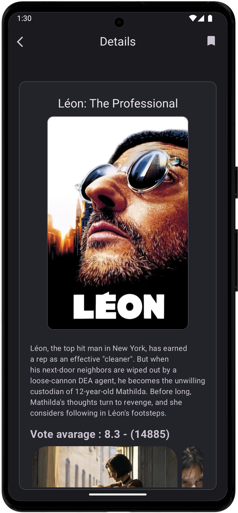

# Movie App

Movie App is an Android application that uses TheMovieDB API to allow users to search for movies and artists, view their details, and save movies to a local database. The app supports both dark and light themes with a modern design.

## Features
- Search for movies and artists
- View movie details
- Save movies to a local database
- Support for dark and light themes

## Architecture
The app follows the **MVVM (Model-View-ViewModel)** architecture pattern to ensure a clear separation of concerns and make the codebase more maintainable and testable. 
- **Model**: Handles the data layer, including network and local database operations.
- **View**: Displays the data and interacts with the user.
- **ViewModel**: Serves as a bridge between the Model and View, providing the necessary data and handling user interactions.

## Technologies and Libraries Used

- **Kotlin**: Programming language for Android development
- **MVVM Architecture**: Model-View-ViewModel structure
- **Hilt**: Dependency injection
- **Retrofit**: API requests management
- **Gson**: Parsing JSON data
- **Room**: Local database management
- **LiveData** and **ViewModel**: Reactive data flow and UI state management
- **Coroutines**: For asynchronous operations
- **Navigation Component**: In-app navigation
- **Glide**: Image loading and caching
- **Material Design**: Modern and aesthetic UI


## Screenshots

<table>
  <tr>
    <th>Home Screen</th>
    <th>Light Theme</th>
    <th>Details</th>
    <th>Gif</th>
  </tr>
  <tr>
    <td></td>
    <td></td>
    <td></td>
    <td></td>
  </tr>
</table>


## Setup

1. Clone this repository:
    ```bash
    git clone https://github.com/azadkiziltas/MovieAppAndroidKotlinMVVM.git
    ```
2. Open the project in Android Studio.
3. Add the required API keys to the **Constants.kt** file:
    ```Kotlin
    const val API_KEY = "Enter your api key"
    ```
4. Sync Gradle and run the app on a device.

## License

This project is licensed under the MIT License. See the [LICENSE](LICENSE) file for more details.

---

If you have any questions or suggestions, feel free to open an issue or contact me at [azadkiziltas@outlook.com](mailto:azadkiziltas@outlook.com).

